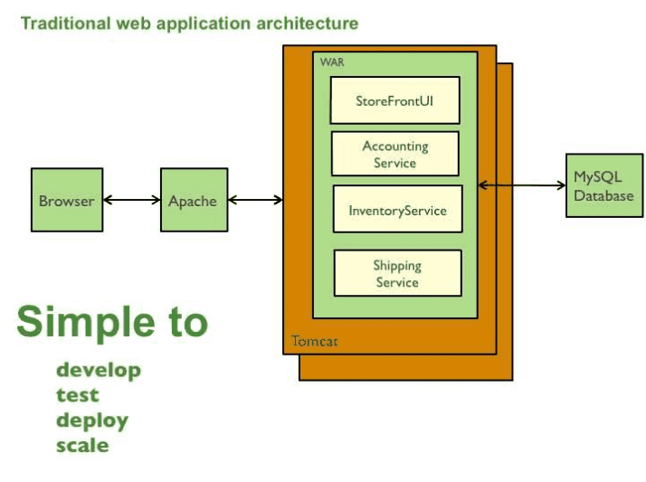
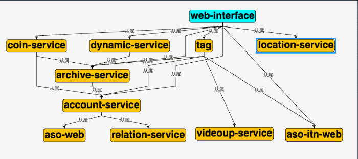
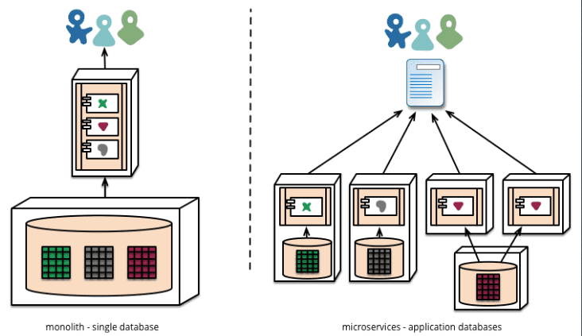

# 微服务概览

## 为什么会有微服务
在业务量比较小的时候，基本上大家都是从单体架构开始的，springMVC啊，beego啊，gin啊，都是单体架构的一些常见框架，尽管也有分层，分模块开发，但是最终它还是会打包并部署为单体式应用。就如下图所示：

随着业务慢慢起来，模块越来越多，问题就出来了：
- 其中最主要问题就是这个应用太复杂，以至于任何单个开发者都不可能搞懂它。
- 应用无法扩展，可靠性很低，最终，敏捷性开发和部署变的无法完成。

那我们要怎么去应对呢？
- 化繁为简，分而治之 
把这一大坨的巨石架构的东西按照一定的划分（可以是业务，可以是资源，也可以参照DDD设计）拆分成一个个微服务去进行处理，每个服务各司其职，其他想用你这个服务的东西就去调你的接口，然后再把最终的接口暴露给客户端，让整个开发变得舒服起来。

## 微服务起源
先讲个概念：**SOA**（面向服务的架构）：  
面向服务的架构（SOA）是一个组件模型，它将应用程序的不同功能单元（称为服务）进行拆分，并通过这些服务之间定义良好的接口和协议联系起来。

而微服务呢？就是SOA思想的一种实践。你应该把微服务看作是SOA的一种特定方法，就像XP或Scrum是敏捷软件开发的特定方法一样。
- 小即是美：小的服务代码少，bug 也少，易测试，易维护，也更容易不断迭代完善的精致进而美妙。
- 单一职责：一个服务也只需要做好一件事，专注才能做好。
- 尽可能早地创建原型：尽可能早的提供服务 API，建立服务契约，达成服务间沟通的一致性约定，至于实现和完善可以慢慢再做。
- 可移植性比效率更重要：服务间的轻量级交互协议在效率和可移植性二者间，首要依然考虑兼容性和移植性。

## 微服务定义

围绕业务功能构建的，服务关注单一业务，服务间采用轻量级的通信机制，可以全自动独立部署，可以使用不同的编程语言和数据存储技术。

微服务架构通过业务拆分实现服务组件化，通过组件组合快速开发系统，业务单一的服务组件又可以独立部署，使得整个系统变得清晰灵活。

优点：
- 服务拆分后比较小，BUG 少，容易测试和维护，也容易扩展
- **原子服务**，一个服务只做一件事情，并且这个属于这个服务的也不应该拆分到其他服务去
- **独立进程**，一个服务只有一个独立进程，可以很好的和当前的容器化进行结合，无状态的服务可以很容易的享受到，k8s 上的故障转移，自动重启等好处
- **隔离部署**，每个服务之间独立部署，可以避免相互影响，并且和按需进行分配资源，节省成本
- **去中心化服务治理**
  - 数据去中心化，每个服务独享数据库，缓存等设施，也有个别情况多个服务共享数据库，例如面向用户的管理后台和面向管理员的管理后台
  - 治理去中心化
  - 技术去中心化，每个服务可以使用适合自己的技术进行实施，但是注意如果技术栈过于发散对于企业或者团队本身也是不利的

缺点：
- **服务之间的依赖关系复杂**，成千上万个服务相互依赖就像一团乱麻一样，剪不断理还乱。
  - 常见的解决方案：全链路追踪，例如， opentracing
- 微服务本身是分布式系统，需要使用 RPC 或者 消息进行通信，此外，**必须要写代码来处理消息传递中速度过慢或者服务不可用等局部失效问题**
  - 例子：服务调用流量会容易被放大，如果 服务 A -> B ->C 如果 A 有一个循环调用 B，B 也有一个循环调用 C，那么一个请求到达 C 之后就被放大了 100 倍甚至上千倍。这是扛不住的
  - **常见解决方案：粗粒度的进程间通信（batch 接口，批量请求，避免 n+1 问题），隔离，超时保护，负载保护，熔断、限流、降级、重试，负载均衡**
- 会有**分布式事务问题**，因为现在每个微服务之间都会有一个独立的数据库，事务在单体应用中很好处理，但是在跨服务时会变得很麻烦
  - 常见解决方案：两阶段提交、TCC 等
- 测试会非常复杂，由于依赖多，无法得知是因为功能异常还是依赖的某个服务发版出现问题
  - 多租户可解决（看后面）
- 服务模块间的依赖，应用的升级有可能会波及多个服务模块的修改。
  - 切记，在服务需要变更时我们要特别小心，服务提供者的变更可能引发服务消费者的兼容性破坏，时刻谨记保持服务契约(接口)的兼容性
  - 发送时要保守，接收时要开放。按照伯斯塔尔法则的思想来设计和实现服务时，发送的数据要更保守，意味着最小化的传送必要的信息，接收时更开放意味着要最大限度的容忍冗余数据，保证兼容性。
- 对**基础建设的要求很高**，基础设施需要自动化，日志采集，监控数据采集，告警，CICD，K8s 等
  - 常见解决方案：上云，花钱能解决的问题永远不是问题！！

## 组件服务化
