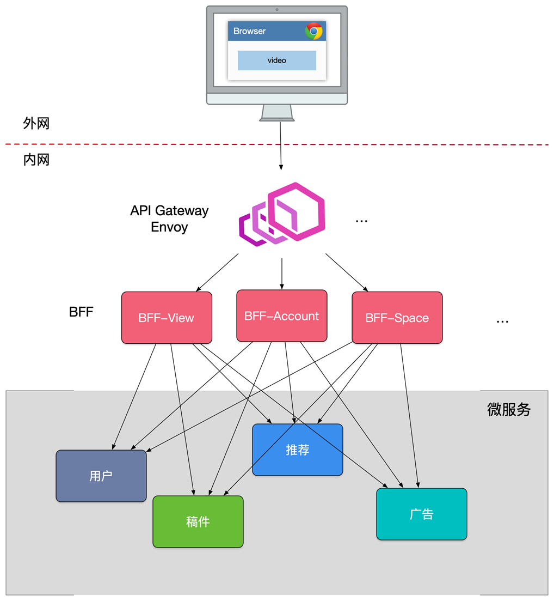
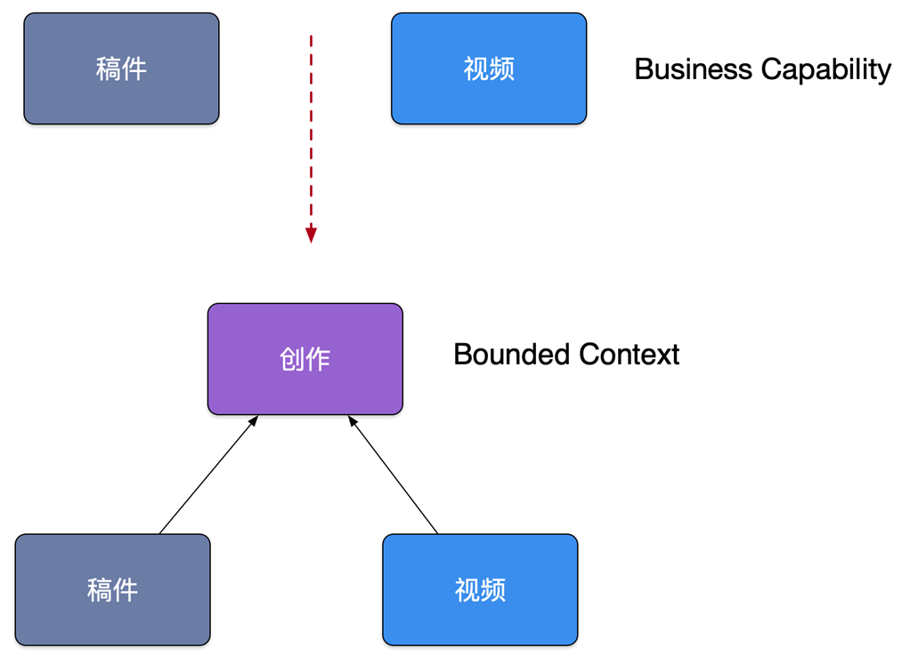

# 微服务设计

## 如何暴露API接口

上图的后端架构可分为三层：
- **ApiGetway层**
- **BFF层**
- **services层**

**ApiGetway层**：跨横切面(Cross-Cutting Concerns)的功能，需要协调更新框架升级发版(路由、认证、限流、安全)，因此全部上沉到这一层。

**BFF层**：这一层主要做数据的组装，提供最终接口用于数据展示，并不处理业务逻辑。并且可以根根业务场景拆分不同的BFF。
优点：
- 轻量交互：协议精简、聚合
- 差异服务：数据裁剪以及聚合、针对终端定制化API。
- 动态升级：原有系统兼容升级，更新服务而非协议。
- 沟通效率提升，协作模式演进为移动业务+网关小组。

**services层**：最终提供服务的地方，通过RPC或者http协议进行服务间通讯。一般不直接向外暴露。

## 微服务划分

在改进项目结构为微服务架构的时候经常会问：到底要怎么去划分微服务呢？

在实际项目中通常会采用两种不同的方式划分服务边界，即通过业务职能(Business Capability)或是 DDD 的限界上下文(Bounded Context)。

- Business Capability
由公司内部不同部门提供的职能。例如客户服务部门提供客户服务的职能，财务部门提供财务相关的职能。
- Bounded Context
限界上下文是 DDD 中用来划分不同业务边界的元素，这里业务边界的含义是“解决不同业务问题”的问题域和对应的解决方案域，为了解决某种类型的业务问题，贴近领域知识，也就是业务。

就像这个例子，要是按照业务职能划分的话，可以将服务分为稿件服务和视频服务，但是呢，在up主的稿件中，可以有视频，也可以有稿件，就通过上下文界定为创作服务。

