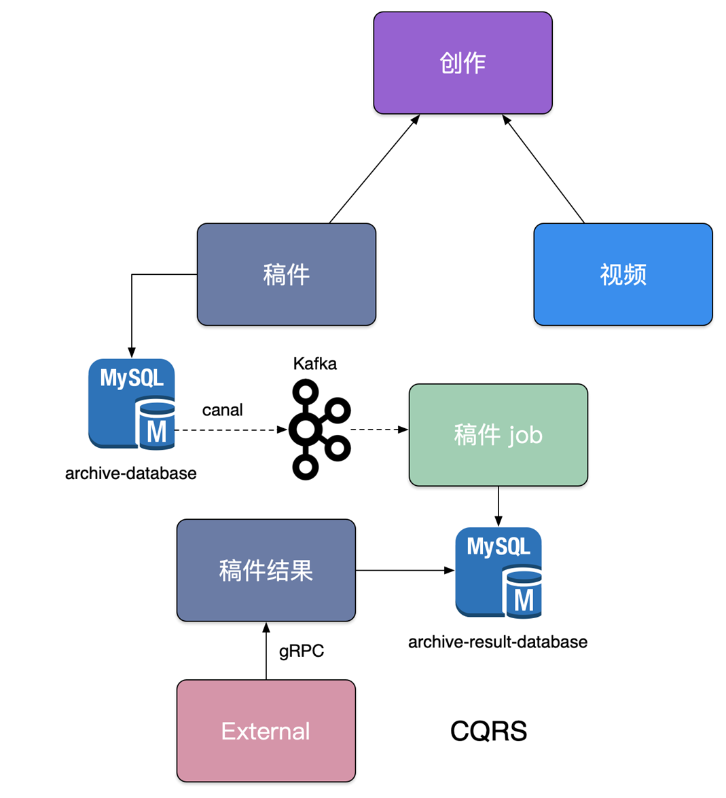

# 微服务设计

## 如何暴露API接口

上图的后端架构可分为三层：
- **ApiGetway层**
- **BFF层**
- **services层**

**ApiGetway层**：跨横切面(Cross-Cutting Concerns)的功能，需要协调更新框架升级发版(路由、认证、限流、安全)，因此全部上沉到这一层。

**BFF层**：这一层主要做数据的组装，提供最终接口用于数据展示，并不处理业务逻辑。并且可以根根业务场景拆分不同的BFF。
优点：
- 轻量交互：协议精简、聚合
- 差异服务：数据裁剪以及聚合、针对终端定制化API。
- 动态升级：原有系统兼容升级，更新服务而非协议。
- 沟通效率提升，协作模式演进为移动业务+网关小组。

**services层**：最终提供服务的地方，通过RPC或者http协议进行服务间通讯。一般不直接向外暴露。

## 微服务划分

在改进项目结构为微服务架构的时候经常会问：到底要怎么去划分微服务呢？

在实际项目中通常会采用两种不同的方式划分服务边界，即通过业务职能(Business Capability)或是 DDD 的限界上下文(Bounded Context)。

- Business Capability
由公司内部不同部门提供的职能。例如客户服务部门提供客户服务的职能，财务部门提供财务相关的职能。
- Bounded Context
限界上下文是 DDD 中用来划分不同业务边界的元素，这里业务边界的含义是“解决不同业务问题”的问题域和对应的解决方案域，为了解决某种类型的业务问题，贴近领域知识，也就是业务。

就像这个例子，要是按照业务职能划分的话，可以将服务分为稿件服务和视频服务，但是呢，在up主的稿件中，可以有视频，也可以有稿件，就通过上下文界定再抽出一层服务作为创作服务。

**CQRS**：将应用程序分为两部分：命令端和查询端。命令端处理程序创建，更新和删除请求，并在数据更改时发出事件。查询端通过针对一个或多个物化视图执行查询来处理查询，这些物化视图通过订阅数据更改时发出的事件流而保持最新。

在稿件服务演进过程中，我们发现围绕着创作稿件、审核稿件、最终发布稿件有大量的逻辑揉在一块，其中稿件本身的状态也有非常多种，但是最终前台用户只关注稿件能否查看，我们依赖稿件数据库 binlog 以及订阅 binlog 的中间件 canal，将我们的稿件结果发布到消息队列 kafka 中，最终消费数据独立组建一个稿件查阅结果数据库，并对外提供一个独立查询服务，来拆分复杂架构和业务。

稿件服务的表头包含了大量的字段，很多与外界信息并不相干，外界服务只关心稿件的1结果。
然后就可以使用canal订阅数据库binlog，通过稿件job对数据库进行清洗，最后将数据汇集在只要稿件结果的数据库。

## 微服务安全设计

对于外网的请求来说，我们通常在 API Gateway 进行统一的认证拦截，一旦认证成功，我们会使用 JWT 方式通过 RPC 元数据传递的方式带到 BFF 层，BFF 校验 Token 完整性后把身份信息注入到应用的 Context 中，BFF 到其他下层的微服务，建议是直接在 RPC Request 中带入用户身份信息(UserID)请求服务。
对应的关系如下：
API Gateway -> BFF -> Service
Biz Auth  -> JWT -> Request Args

但是对于内网的微服务调用呢？

在内网主要看安全级别一般有三种：
- Full Trust：假定内网服务之间是安全的，在内网裸奔
- Half Trust：内网服务之间需要进行认证鉴权，但是不需要所有的都进行加密
- Zero Trust: 零信任，任务内部网络是不安全的，类似公网，所有的请求通过身份认证鉴权之后，都需要通过安全加密，防止被嗅探

一般刚刚开始做微服务都是裸奔的。好像只有阿里做了0信任。

上一节：[微服务概览](./01.微服务概览.md)
下一节：[gRpc&服务发现](./03.gRpc&服务发现.md)