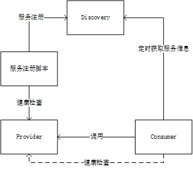
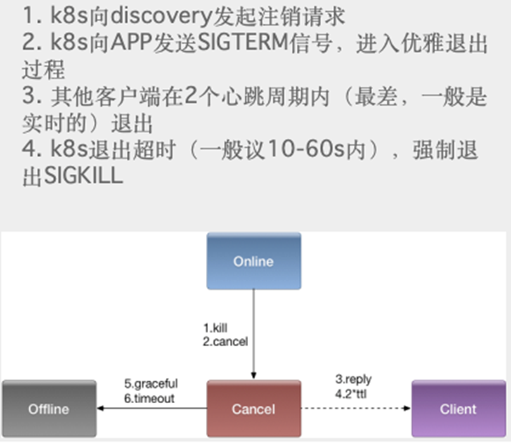
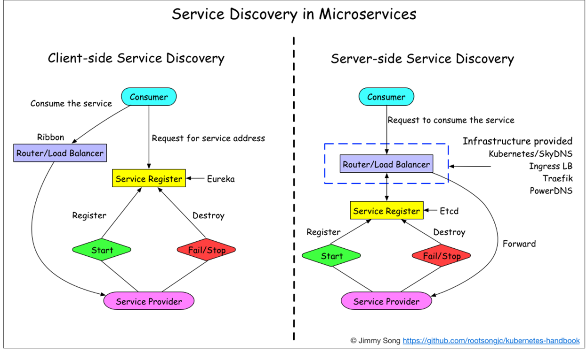
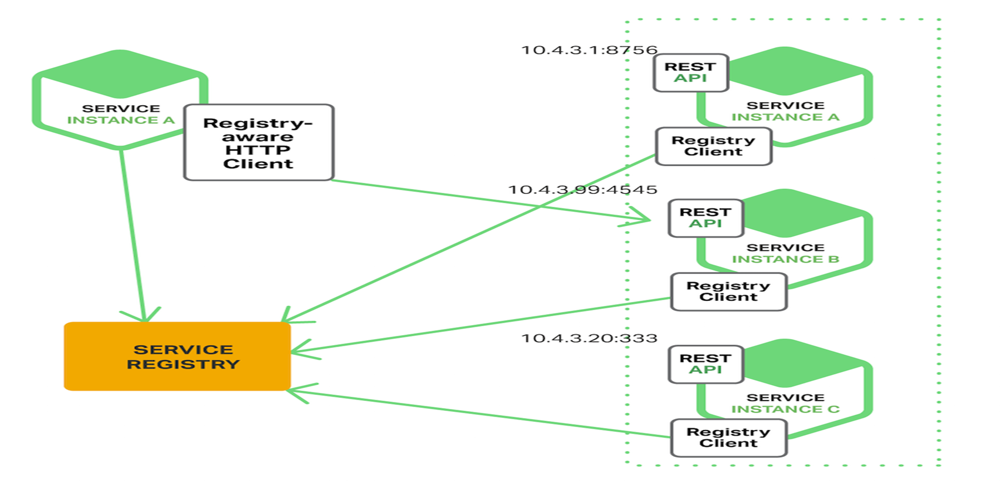
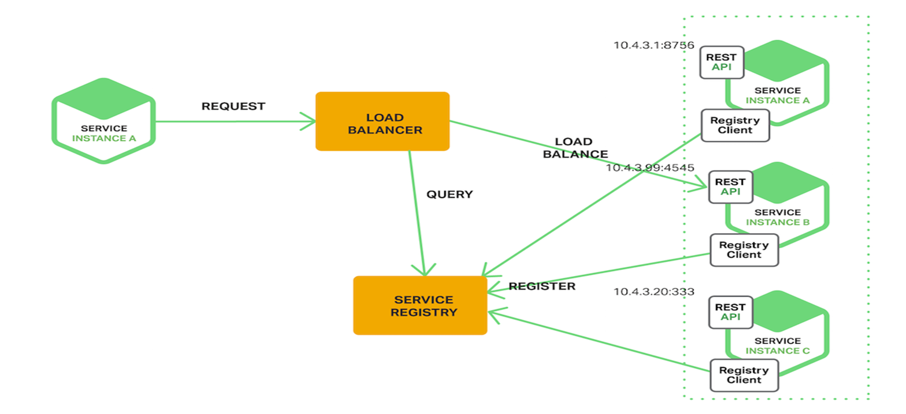
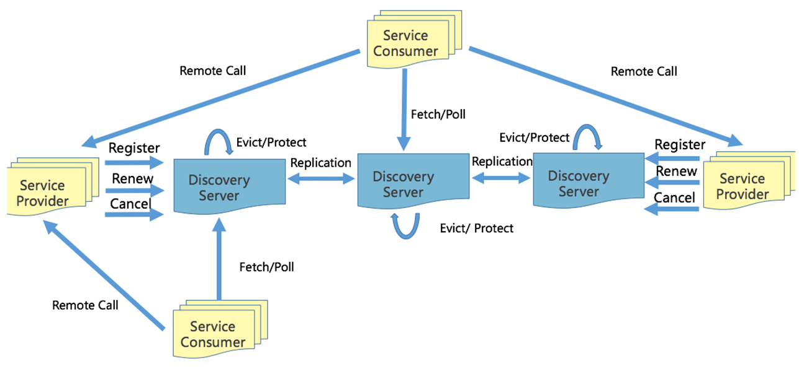

# gRPC & 服务发现

## gRPC

**什么是gPRC？**

>A high-performance, open-source universal RPC framework

就是：高性能、开源的通用RPC框架

**为什么采用 gRPC?**

- **多语言**：语言中立，支持多种语言。
- **轻量级、高性能**：序列化支持 PB(Protocol Buffer)和 JSON，PB 是一种语言无关的高性能序列化框架。
- **可插拔**
- **IDL**：基于文件定义服务，通过 proto3 工具生成指定语言的数据结构、服务端接口以及客户端 Stub。
- 设计理念
- 移动端：基于标准的 HTTP2 设计，支持双向流、消息头压缩、单 TCP 的多路复用、服务端推送等特性，这些特性使得 gRPC 在移动端设备上更加省电和节省网络流量。
- 服务而非对象、消息而非引用：促进微服务的系统间粗粒度消息交互设计理念。
负载无关的：不同的服务需要使用不同的消息类型和编码，例如 protocol buffers、JSON、XML 和 Thrift。
- 流：Streaming API。
- 阻塞式和非阻塞式：支持异步和同步处理在客户端和服务端间交互的消息序列。
- 元数据交换：常见的横切关注点，如认证或跟踪，依赖数据交换。
- **标准化状态码**：客户端通常以有限的方式响应 API 调用返回的错误。

**为什么不用HTTP-restful来交互呢？**
- 每个客户端都需要单独写 SDK，复杂麻烦
- 需要单独写文档，常常会因为代码更新了但是文档没更新陷入坑中
- 性能不太好，json 传递相对于 pb 更耗流量，性能更低
- http1.1 是一个单连接的请求，在内部网络环境，使用 http 比较浪费
- restful 是一个松散约束的协议，非常灵活，每个人，每个团队出来的代码都不太一样，比较容易出错

## 健康检查

主动健康检查 health check，可以在服务提供者服务不稳定时，被消费者所感知。临时从负载均衡中摘除，减少错误请求。当服务提供者重新稳定后，health check 成功，重新加入到消费者的负载均衡，恢复请求。health check，同样也被用于外挂方式的容器健康检测，或者流量检测(k8s liveness & readiness)

1. Provider 启动，定时去检查服务的健康检查接口
2. 健康检查通过之后，服务注册脚本向注册中心注册服务（rpc://ip:port）
3. 消费者定时从服务注册中心获取服务方地址信息
4. 获取成功后，会定时的向服务方发起健康检查，健康检查通过后才会向这个地址发起请求
5. 在运行过程中如果健康检查出现问题，会从消费者本地的负载均衡中移除

同时可以通过健康检测做到平滑发布和平滑下线:

## 服务发现
假设我们写的代码会调用 REST API 或者 Thrift API 的服务。为了完成一次请求，代码需要知道服务实例的网络位置（IP 地址和端口）。

运行在物理硬件上的传统应用中，服务实例的网络位置是相对固定的，代码能从一个偶尔更新的配置文件中读取网络位置。

对于基于云端的、现代化的微服务应用而言，这却是一大难题。将容器应用部署到集群时，其服务地址是由集群系统动态分配的。那么，当我们需要访问这个服务时，如何确定它的地址呢？这时就需要服务发现（Service Discovery）了。

服务发现有两大模式：客户端发现模式和服务端发现模式。

### 服务发现 - 客户端发现

- 一个服务实例被启动时，它的网络地址会被写到注册表上；
- 当服务实例终止时，再从注册表中删除；
- 这个服务实例的注册表通过心跳机制动态刷新；
- 客户端使用一个负载均衡算法，去选择一个可用的服务实例，来响应这个请求。

### 服务发现 - 服务端发现
- 客户端通过负载均衡器向一个服务发送请求，这个负载均衡器会查询服务注册表，并将请求路由到可用的服务实例上。
- 服务实例在服务注册表上被注册和注销(Consul Template+Nginx，kubernetes+etcd)。

### 两者对比：
客户端发现：
直连，比服务端服务发现少一次网络跳转，Consumer 需要内置特定的服务发现客户端和发现逻辑。

服务端发现：
Consumer 无需关注服务发现具体细节，只需知道服务的 DNS 域名即可，支持异构语言开发，需要基础设施支撑，多了一次网络跳转，可能有性能损失。

**微服务的核心是去中心化，目前某站使用客户端发现模式。**

## 服务发现注册中心

**先来聊一聊CAP理论：**
CAP原则又称CAP定理，指的是在一个分布式系统中，一致性（Consistency）、可用性（Availability）、分区容错性（Partition tolerance）。
- **一致性（C）**：在分布式系统中的所有数据备份，在同一时刻是否同样的值。（等同于所有节点访问同一份最新的数据副本）
- **可用性（A）**：在集群中一部分节点故障后，集群整体是否还能响应客户端的读写请求。（对数据更新具备高可用性）
- **分区容忍性（P）**：以实际效果而言，分区相当于对通信的时限要求。系统如果不能在时限内达成数据一致性，就意味着发生了分区的情况，必须就当前操作在C和A之间做出选择。

CAP 原则指的是，这三个要素最多只能同时实现两点，不可能三者兼顾。

接下来看一下现有的服务发现组件对比：

|  | Nacos | Eureka | Consul | Etcd | Zookeeper |
| --- | :---: | :---: | :---: | :---: | :---: |
| 一致性原则 | CP+AP | AP | CP | CP | CP |
| 多数据中心 | 支持 | 支持 | 支持 |  支持| 支持 |
| 一致性协议 | Renew机制 |-  | Raft算法 |Raft算法  |ZAB  |
| 访问协议 | 	HTTP/DNS | 	HTTP | HTTP/DNS | HTTP/Grpc | TCP（RPC客户端） |
| 健康检查 | 	TCP/HTTP/MYSQL/Client Beat | Client Beat | TCP/HTTP/gRPC/Cmd | 长连接  | Keep Alive |
| 监听支持 |支持  |支持  | 支持 |  支持|支持  |

根据业务场景而言:某站早期用是Zookeeper 作为服务发现（别问为啥，问就是只会Zookeeper）。
但是实际场景是海量服务发现和注册，服务状态可以弱一致, 需要的是 AP 系统。

- 分布式协调服务(要求任何时刻对 ZooKeeper的访问请求能得到一致的数据，从而牺牲可用性)。
- 网络抖动或网络分区会导致的 master 节点因为其他节点失去联系而重新选举或超过半数不可用导致服务注册发现瘫痪。
- 大量服务长连接导致性能瓶颈。

所以某站参考Eureka实现了自己的[AP发现服务](https://github.com/bilibili/discovery)：
试想两个场景，牺牲一致性，最终一致性的情况：
- 注册的事件延迟：新上节点可以等一会儿就可以用了
- 注销的事件延迟

### 实现原理：

- 注册：服务方启动后向注册中心任意一个节点发送注册请求，然后这个节点会向其他节点进行广播同步
- 通过 Family(appid) 和 Addr(IP:Port) 定位实例，除此之外还可以附加更多的元数据：权重、染色标签、集群等。
  - appid: 使用三段式命名，business.service.xxx
- Provider  注册后定期(30s)心跳一次，注册， 心跳，下线都需要进行同步，注册和下线需要进行长轮询推送。
  - 新启动节点，需要 load cache，JVM 预热。
  - 故障时，Provider 不建议重启和发布。

- 下线：下线时向注册中心发送下线请求
- Consumer 启动时拉取实例，发起30s长轮询。
  - 故障时，需要 client 侧 cache 节点信息。
- Server 定期(60s) 检测失效(90s)的实例，失效则剔除。短时间里丢失了大量的心跳连接(15分钟内心跳低于期望值*85%)，开启自我保护，保留过期服务不删除。

**注意**：注册中心节点启东市需要加载缓存进行预热，所以不建议这个时候服务进行重启或者是发版

长轮询的时候直接将所有的注册下线信息都拉出来。

**注册中心故障**：

- 不建议这个时候服务进行重启或者是发版，因为这个时候注册不上，会导致服务不可用，不发版短时间没有影响
- 如果全部挂掉，启动时必须要等两到三个心跳周期，等所有的服务都注册上之后再开始提供服务运行消费者拉取数据
- 如果挂掉一个，需要等其他的节点将信息同步到本机之后再提供服务
- 数据同步时会对比时间戳，会保证当前节点的数据是最新的

