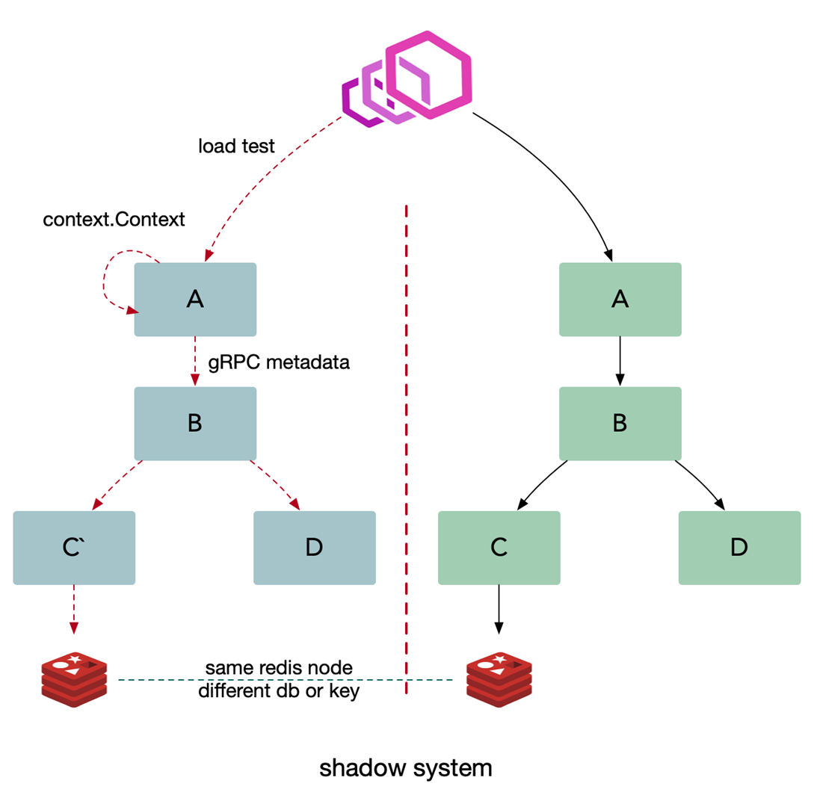

# 多集群&多租户

## 为什么要有多集群：

L0 服务，类似像我们账号，之前是一套大集群，一旦故障影响返回巨大，所以我们从几个角度考虑多集群的必要性：
- 从单一集群考虑，多个节点保证可用性，我们通常使用 N+2 的方式来冗余节点。(N 一般通过压测得出)
- 从单一集群故障带来的影响面角度考虑冗余多套集群。(例如依赖的 redis 出现问题，整个集群挂掉了)
- 单个机房内的机房故障导致的问题。(多机房部署，如果在云上可能是多个可用区)

## 怎么实现多集群

利用 paas 平台，给某个 appid 服务建立多套集群(物理上相当于两套资源，逻辑上维护 cluster 的概念)，对于不同集群服务启动后，从环境变量里可以获取当下服务的 cluster，在服务发现注册的时候，带入这些元信息。当然，不同集群可以隔离使用不同的缓存资源等。

- 多套冗余的集群对应多套独占的缓存，带来更好的性能和冗余能力。
- 尽量避免业务隔离使用或者 sharding 带来的 cache hit 影响（按照业务划分集群资源）

**业务隔离集群带来的问题是 cache hit ratio 下降，不同业务形态数据正交，我们推而求其次整个集群全部连接。**

## 可能出现的问题：
统一为一套逻辑集群（物理上多套资源池），即 gRPC 客户端默认忽略服务发现中的 cluster 信息，按照全部节点，全部连接。
对于账号这种大量服务依赖的服务，在没有业务调用的时候，仅仅是健康检查流量就会导致30%以上的资源占用（B站之前的真实情况）

- 长连接导致的内存和 CPU 开销，HealthCheck 可以高达30%。
- 短连接极大的资源成本和延迟。

所以能不能找到一种算法从全集群中选取一批节点(子集)，利用划分子集限制连接池大小。
- 通常20-100个后端，部分场景需要大子集，比如大批量读写操作。
- 后端平均分给客户端。
- 客户端重启，保持重新均衡，同时对后端重启保持透明，同时连接的变动最小。

~~~go
// @Title Subset
// @Description 子集算法
// @Param	backends    server端列表
// @Param	clientID    给客户端分配的id
// @Param	subsetSize  客户端的连接量需求
func Subset(backends []string, clientID, subsetSize int) []string {
    subsetCount := len(backends) / subsetSize

    // Group clients into rounds; 
    //each round uses the same shuffled list:
    round := clientID / subsetCount

    r := rand.New(rand.NewSource(int64(round)))
    r.Shuffle(len(backends), func(i, j int) { backends[i], backends[j] = backends[j], backends[i] })

    // The subset id corresponding to the current client:
    subsetID := clientID % subsetCount

    start := subsetID * subsetSize
    return backends[start : start+subsetSize]
}
~~~

为什么上面这个算法可以保证可以均匀分布？ 

- 首先，shuffle 算法保证在 round 一致的情况下，backend 的排列一定是一致的。 
- 因为每个实例拥有从 0 开始的连续唯一的自增 id，且计算过程能够保证每个 round 内所有实例拿到的服务列表的排列一致，
- 因此在同一个 round 内的 client 会分别 backend 排列的不同部分的切片作为选中的后端服务来建立连接。 
- 所以只要 client id 是连续的，那么 client 发向 后端的连接就一定是连续的。

## 什么是多租户

在一个微服务架构中允许多系统共存是利用微服务稳定性以及模块化最有效的方式之一，这种方式一般被称为多租户(multi-tenancy)。

租户可以是测试，金丝雀发布，影子系统(shadow systems)，甚至服务层或者产品线，使用租户能够保证代码的隔离性并且能够基于流量租户做路由决策

**对于传输中的数据(data-in-flight)（例如，消息队列中的请求或者消息）以及静态数据(data-at-rest)（例如，存储或者持久化缓存），租户都能够保证隔离性和公平性，以及基于租户的路由机会。**

如果我们对服务 B 做出改变，我们需要确保它仍然能够和服务 A，C，D 正常交互。在微服务架构中，我们需要做这些集成测试场景，也就是测试和该系统中其他服务的交互。通常来说，微服务架构有两种基本的集成测试方式：并行测试和生产环境测试。

其实也就是说，在同一套服务中有多个不同隔离的系统。

## 怎么解决测试环境

在微服务环境中，可能服务上下有多个调用链，如A->B->C,我在测B的时候，突然一下，啪，别人又更新上了一个版本，这就大条了。所以在之前一般会这样做：

工程师团队首先完成生产服务的一次变动，然后将变动的代码部署到测试栈。这种方法可以在不影响生产环境的情况下让开发者稳定的测试服务，同时能够在发布前更容易的识别和控制 bug。

也就是**多套物理环境**，但是会出现一下不足：
- 混用环境导致的不可靠测试。
- 多套环境带来的硬件成本。
- 难以做负载测试，仿真线上真实流量情况。
- 治标不治本，无法知道当前环境谁在使用，并且几套环境可以满足需求？万一又多几个人开发是不是又需要再来几套？

### 染色发布

这时候染色发布就出来了：

我们可以把待测试的服务 B 在一个隔离的沙盒环境中启动，并且在沙盒环境下可以访问集成环境(UAT) C 和 D。我们把测试流量路由到服务 B，同时保持生产流量正常流入到集成服务。服务 B 仅仅处理测试流量而不处理生产流量。另外要确保集成流量不要被测试流量影响。生产中的测试提出了两个基本要求，它们也构成了多租户体系结构的基础：
- 流量路由：能够基于流入栈中的流量类型做路由。
- 隔离性：能够可靠的隔离测试和生产中的资源，这样可以保证对于关键业务微服务没有副作用。

例子：

**注册流程**

- 假设我们现在有一套问题的 FAT1 测试环境，然后现在对应用 B 做了修改
- 开发同学通过发布平台发布一个新的 B 应用 B，并且带上环境标签，例如:red`
应用 B向注册中心进行注册时候会带上red` 标签
- 消费者 A 在向注册中心获取服务节点数据的时候也会获取到这个标签，并且在本地的负载均衡当中使用 map[string]pool 的结构进行保存

**调用流程**

- 测试同学通过 A 进行调用测试，如果是 http 就在 header 中打上这个 red 标签，如果是 grpc 就在 metadata 中加入这个标签
- A 调用 B 的时候，发现header中存在 red 标签就会去本地负载均衡查询，发现负载均衡中有 red 标签的连接，这个之后就直接调用到 B`，并且在调用的时候 A 会将 header 的标签信息进行透传
- B` 收到请求之后，需要调用 C、D 这时候也是一样的会去负载均衡中进行查询，发现没有就会退回到默认的连接池中
如何进行联调？
- 需要联调的应用打上相同的标签就可以了

**注意事项**

- 应用版本发布时数据结构，例如 db 中的表，redis 中的 key，必须保证向下兼容
- 测试的时候需要使用不同的测试账号
- 注意来自外网的请求中的 header 必须删除，确保安全

## 多租户本质
多租户架构本质上描述为：
**跨服务传递请求携带上下文(context)，数据隔离的流量路由方案。**

给入站请求绑定上下文(如: http header)， in-process 使用 context 传递，跨服务使用 metadata 传递(如: opentracing baggage item)，在这个架构中每一个基础组件都能够理解租户信息，并且能够基于租户路由隔离流量，同时在我们的平台中允许对运行不同的微服务有更多的控制，比如指标和日志。在微服务架构中典型的基础组件是日志，指标，存储，消息队列，缓存以及配置。基于租户信息隔离数据需要分别处理基础组件。

利用服务发现注册租户信息，注册成特定的租户。

## 如何进行全链路压测

和上面的测试环境的解决方案类似，但是我们需要搭建一套和线上一致的影子系统

- 如何解决压测数据对线上数据的影响
- 基础设施需要做改造，采用同样的基础设施节点
- 缓存：影子应用存储的数据放到影子库中，使用不同的db
- 数据库：自动将线上的数据结构复制一份到影子数据库中。里面的表结构保持一致，数据库名做一些变化，例如 db_shadow
- 消息队列: 推送消息的时候使用不同的 topic 或者是携带一些 metadata 信息
需要提前做一些数据初始化的操作，提前进行准备
- 压测时携带压测标签，将流量自动路由到影子服务进行压测
这种方案同样可以用于灰度发版当中

上一节：[gRpc&服务发现](./03.gRpc&服务发现.md)
下一节：[Go语言Error处理](./../../Week02/README.md)