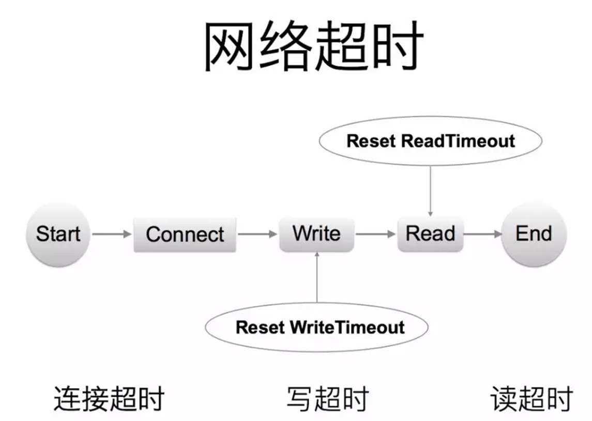
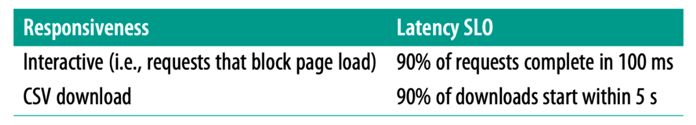

# 超时控制

超时控制，我们的组件能够快速失效(fail fast)，因为我们不希望等到断开的实例直到超时。没有什么比挂起的请求和无响应的界面更令人失望。这不仅浪费资源，而且还会让用户体验变得更差。我们的服务是互相调用的，所以在这些延迟叠加前，应该特别注意防止那些超时的操作。

- 网路传递具有不确定性。
- 客户端和服务端不一致的超时策略导致资源浪费。
- “默认值”策略。
- 高延迟服务导致 client 浪费资源等待，使用超时传递: 进程间传递 + 跨进程传递。

超时控制是微服务可用性的第一道关，良好的超时策略，可以尽可能让服务不堆积请求，尽快清空高延迟的请求，释放 Goroutine。

实际业务开发中，我们依赖的微服务的超时策略并不清楚，或者随着业务迭代耗时超生了变化，意外的导致依赖者出现了超时。

- 服务提供者定义好 latency SLO，更新到 gRPC Proto 定义中，服务后续迭代，都应保证 SLO。

~~~go
package google.example.library.v1;

service LibraryService {
    // Lagency SLO: 95th in 100ms, 99th in 150ms.
    rpc CreateBook(CreateBookRequest) returns (Book); 
    rpc GetBook(GetBookRequest) returns Book);
    rpc ListBooks(ListBooksRequest) returns (ListBooksResponse);
}
~~~
避免出现意外的默认超时策略，或者意外的配置超时策略。

- kit 基础库兜底默认超时，比如 100ms，进行配置防御保护，避免出现类似 60s 之类的超大超时策略。
- 配置中心公共模版，对于未配置的服务使用公共配置。

**超时传递**: 当上游服务已经超时返回 504，但下游服务仍然在执行，会导致浪费资源做无用功。超时传递指的是把当前服务的剩余 Quota 传递到下游服务中，继承超时策略，控制请求级别的全局超时控制

- 进程内超时控制
一个请求在每个阶段(网络请求)开始前，就要检查是否还有足够的剩余来处理请求，以及继承他的超时策略，使用 Go 标准库的 [context.WithTimeout](https://pkg.go.dev/context#WithTimeout)

~~~go
func (c *asiiConn) Get(ctx context.Context, key string) (result *Item, err error) {
	c.conn.SetWriteDeadline(shrinkDeadline(ctx, c.writeTimeout))
	if _, err = fmt.Fprintf(c.rw, "gets %s\r\n", key); err != nil {
    }

}
~~~